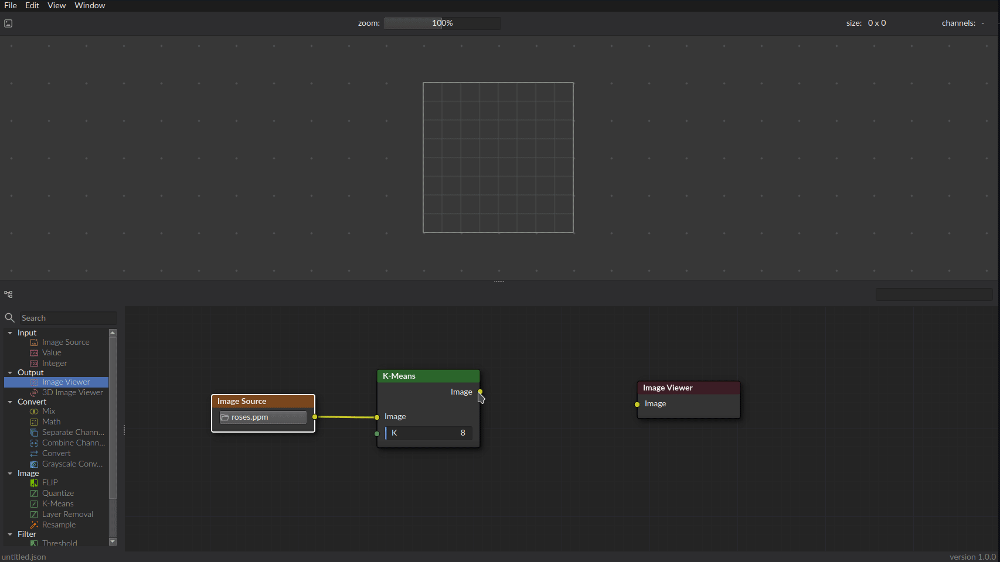

<br />
<p align="center">
  <h1 align="center">NITRO</h1>

  <p align="center">
    Powerful and flexible node editor that facilitates building complex combinations of various image processing techniques. 
  </p>
</p>

   

## About the project

NITRO is a powerful tool for building complex image processing routines. Instead of needing to modify source code or
scripts to process images in different ways, you can use this visual node editor to do that instead. The project was
developed with extendability in mind, making it easy to add your own types nodes, and widgets. For more information on
this, see [Project Structure](#project-structure). The UI was inspired by
Blender's [Shader Editor](https://docs.blender.org/manual/en/latest/editors/shader_editor.html)

The project was originally developed for my Master thesis at the University of Groningen. That is also the origin of the
name NITRO: Niels' Image-processing Thesis on Reconstruction Operations



## Disclaimer

The project is still in development and can be considered in early-alpha. As such, I am still working hard on fixing
bugs and adding new features.
If you encounter any, please feel free to create an issue.

## Getting Started

These instructions will get you a copy of the project up and running on your local machine.

### Prerequisites

- [CMake 3.9+](https://cmake.org/)
- [Qt6](https://www.qt.io/product/qt6)
- [OpenGL 4.1+](https://www.opengl.org/)
- [OpenCV 4](https://opencv.org/)

#### Ubuntu Install Instructions

- CMake
  ```shell
  sudo apt install cmake
  ```
- Qt6
  ```shell
  sudo apt install qt6-base-dev
  ```
- OpenGL
  Should be supported by default. My night to install `mesa-utils`
  ```shell
  sudo apt install mesa-utils
  ```
- OpenCV 4
  ```shell
  sudo apt install libopencv-dev
  ```

### Dependencies

These dependencies are used by NITRO and are included as Git submodules. As such, these don't need to be manually
installed.

- [QtNodes](https://github.com/BugelNiels/nodeeditor)
    - A custom fork of
      the [QtNodes](https://github.com/paceholder/nodeeditor) repo.
- [Qt Value Sliders](https://github.com/BugelNiels/qt-value-slider)
    - A custom widget that allows for user-friendly
      control of numerical inputs.
- [FLIP](https://github.com/NVlabs/flip)
    - A state-of-the-art image comparison algorithm developed by NVIDIA.

### Installing

To set up the repository locally, clone the repository:

```shell
git clone --recurse-submodules git@github.com:BugelNiels/nitro.git
```

In case `--recurse-submodules` was not used, you can initialize the submodules using:

```shell
git submodule init
git submodule update
```

### Building

To build the project, can execute the `build.sh` script and run the resulting binary:

```shellell
sh build.sh
./bin/nitro
```

Alternatively, you can manually build and run the program:

```shell
mkdir build
cd build
cmake -DCMAKE_BUILD_TYPE=Release ..
make -j8
./nitro
```

## Features

A few notable features on top of the node editor itself are:

- Image Viewer 
- 3D Image Viewer 

## Project Structure

The project was developed with the aim of making it easily extendable. Below a number of code details are outlined to
illustrate some basic example usages of the project and how to extend it.

### Modules

NITRO works with a module system for its node. By using this module system, users can determine at compile-time which
modules to include and which modules to exclude. These modules are then automatically registered when the program
starts.

The different modules can be found in the `modules/` directory. Currently, there are two modules here:

- **imcore**. This is the main module. It provides support for basic image operations and the image viewer widget.
- **im3d**. This module contains some nodes that can be used to compress and enhance bit-depth. Additionally, it
  contains a widget that allows for viewing of images as 3D objects.

Adding new modules can be done by following a similar structure to the existing module:

- Create an implementation of `imcoremodule.hpp`. This implementation should register the new nodes, in addition to the
  data types and widgets (if there are any).
- Create a `CMakeLists.txt` to create a library of the module. See
  e.g. [this CMakeLists.txt](modules/imcore/CMakeLists.txt) on how to do this.
  Note that any libraries used in the module, must unfortunately still be found and linked in the
  main [CMakeLists.txt](CMakeLists.txt). A future release should hopefully fix this issue.
- Add any nodes, data types or widgets as needed (see below).

### Nodes

Nodes are built using the builder-pattern to ensure maximum flexibility. As such, new nodes are not created by creating
a subclass of `NitroNode`. Instead, nodes are built dynamically at runtime.
Each node will typically have a `NodeOperator`. This operator is what performs the actual computation of the node.
For details on how to construct a node, you can look at the [NitroNodeBuilder](include/nodes/nitronodebuilder.hpp)
class.

A simple implementation of a threshold node is then as follows:

[Header file](modules/imcore/src/nodes/operators/filters/threshold.hpp)

```c++
#pragma once

#include "nodes/nodeoperator.hpp"
#include "nodes/nitronode.hpp"

namespace nitro {

    class ThresholdOperator : public NodeOperator {
    public:

        static std::function<std::unique_ptr<NitroNode>()> creator(const QString &category);

        void execute(NodePorts &nodePorts, const std::map<QString, int> &options) const override;

    };

} // nitro
```

[Source file](modules/imcore/src/nodes/operators/filters/threshold.cpp)

```c++
#include "threshold.hpp"
#include "nodes/nitronodebuilder.hpp"
#include <opencv2/imgproc.hpp>

void nitro::ThresholdOperator::execute(NodePorts &nodePorts, const std::map<QString, int> &options) const {
    // Retrieving of input parameters
    bool greater = options.at("Mode") == 1;
    auto type = greater ? cv::THRESH_BINARY : cv::THRESH_BINARY_INV;
    bool imPresent, tPresent;
    auto inputImg = nodePorts.getInputImage("Image", imPresent);
    int threshold = nodePorts.getInputInteger("Threshold", tPresent);
    if(!imPresent || !tPresent) {
        return;
    }

    // Actual Threshold operation
    cv::Mat result;
    cv::threshold(*inputImg, result, threshold, 255, type);

    // Set node output
    nodePorts.setOutputImage("Image", std::make_shared<cv::Mat>(result));
}

std::function<std::unique_ptr<nitro::NitroNode>()> nitro::ThresholdOperator::creator(const QString &category) {
    return [category]() {
        nitro::NitroNodeBuilder builder("Threshold", "threshold", category);
        return builder.
                withOperator(std::make_unique<nitro::ThresholdOperator>())->
                withIcon(":/icons/nodes/threshold.png")->
                withNodeColor({43, 101, 43})->
                withDropDown("Mode", {"<=", ">="})->
                withInputImage("Image")->
                withInputInteger("Threshold", 128, 0, 255)->
                withOutputImage("Image")->
                build();
    };
}

```

### Data Types

New data types can be added by creating an implementation of `QtNodes::NodeData`. For example, the integer data type has
the following structure:

```c++
namespace nitro {
    class IntegerData : public QtNodes::NodeData {
    public:
        IntegerData() = default;

        explicit IntegerData(int val) : val_(val) {
        }

        static QtNodes::DataInfo dataInfo() {
            return {"Value", "integer", {89, 140, 92}};
        }

        QtNodes::NodeDataType type() const override {
            return QtNodes::NodeDataType{dataInfo().getDataId(), dataInfo().getDataName()};
        }

        int value() const { return val_; }

    private:
        int val_;
    };
} // nitro
```

Note that, while not required, each data type should ideally have a method for retrieving its data info. This way, the
data type can be registered properly.

## License

This project is licensed under the MIT License - see the [LICENSE.md](LICENSE.md) file for details

